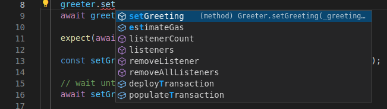

# Hardhat vs locklift and SweetPie
## Goals
Сравнение Hardhat и locklift
* [Hardhat](https://github.com/nomiclabs/hardhat) - одно из лучших решений для разработки контрактов в блокчейне Ethereum.
* [locklift](https://github.com/broxus/ton-locklift) - единственное существующее решение на Everscale

Цели:
1. Показать разницу между Hardhat и locklift
2. Предложить улучшения существующих решений, если это возможно
3. Написать, как будут выглядеть эти решения в SweetPie


## Documentation
### Hardhat
* `+` [source](https://github.com/nomiclabs/hardhat/tree/master/docs)
* `+` [website](https://hardhat.org/getting-started)
* `-` localization - N/A

Good documentation. All main tasks is covered

### locklift
* `+` [source](https://github.com/broxus/ton-locklift)
* `-` website - N/A
* `-` localization - N/A

Poor documentation

### SweetPie
* `✓` source - то же решение, что Hardhat. Markdown-файлы
* `✓` website - генерация HTML страниц из Markdown-файлов, и публикация их на sweetpie.org
* `✓` localization - перевод на 6 мировых языков

Задача - покрыть документацией весь функционал


## Social media
### Hardhat
* `+` [Discord](https://hardhat.org/discord)
* `+` [Twitter](https://twitter.com/HardhatHQ)
* `+` [Medium](https://hardhat.medium.com)

Hardhat широко представлен в социальных медиа

### locklift
* `-` Отсутствуют какие-либо статьи или ссылки для обсуждения

### SweetPie
Задача:
* `✓` Покрыть основные социальные платформы: Twitter, Discord, Telegram и Medium


## Installation
### Hardhat
* `+` Локальная установка
```shell
npm install --save-dev hardhat
```

### locklift
* `-` Глобальная установка
```shell
npm install -g locklift
```

### sweetpie
* `✓` Глобальная установка
```shell
npm install -D sweetpie
```

Hardhat устанавливается локально. Это неудобно для создания новых проектов - каждый раз требуется ждать скачивания. 
Однако, у локальной установки есть преимущество.
Если новая версия Hardhat оказывается несовместимой с предыдущей версией, при глобальной установке это может вызвать большие проблемы.
При локальной же установке эти проблемы легко решаются редактированием package.json.
В SweetPie предлагается использовать локальную установку.


## How to create project
### Hardhat
```shell
$ npx hardhat
888    888                      888 888               888
888    888                      888 888               888
888    888                      888 888               888
8888888888  8888b.  888d888 .d88888 88888b.   8888b.  888888
888    888     "88b 888P"  d88" 888 888 "88b     "88b 888
888    888 .d888888 888    888  888 888  888 .d888888 888
888    888 888  888 888    Y88b 888 888  888 888  888 Y88b.
888    888 "Y888888 888     "Y88888 888  888 "Y888888  "Y888

Welcome to Hardhat v2.0.8

? What do you want to do? …
❯ Create a sample project
  Create an advanced sample project
  Create an advanced sample project that uses TypeScript
  Create an empty hardhat.config.js
  Quit
```
* `+` Удобное меню для создания нового проекта


### locklift
```shell
$ locklift init --path amazing-locklift-project
New Locklift project initialized in amazing-locklift-project
```
* `-` Нет удобного меню. Отсутствует возможность выбрать TypeScript при создании нового проекта

### sweetpie
```text
$ npx sweetpie
███████╗██╗    ██╗███████╗███████╗████████╗    ██████╗ ██╗███████╗
██╔════╝██║    ██║██╔════╝██╔════╝╚══██╔══╝    ██╔══██╗██║██╔════╝
███████╗██║ █╗ ██║█████╗  █████╗     ██║       ██████╔╝██║█████╗  
╚════██║██║███╗██║██╔══╝  ██╔══╝     ██║       ██╔═══╝ ██║██╔══╝  
███████║╚███╔███╔╝███████╗███████╗   ██║       ██║     ██║███████╗
╚══════╝ ╚══╝╚══╝ ╚══════╝╚══════╝   ╚═╝       ╚═╝     ╚═╝╚══════╝                                                                 

v1.0.0
❯ Create. JavaScript
  Create. TypeScript
  Quit
```
* `✓` Будет удобное меню для создания проекта, как у Hardhat


## Hardhat local node
### Hardhat
* `+` Можно запустить локальную ноду для разработки одной командой
* `+` [Автоматический запуск ноды при запуске кода](https://hardhat.org/hardhat-network/#how-can-i-use-it)
* `-` Нельзя указать в конфиге версию локальной ноды

### locklift
* `-` Для запуска локальной ноды используется Everdev
* `-` Нет автоматического запуска локальной ноды при запуске тестов
* `-` Запуск локальной ноды с нужной версией делается вручную

### sweetpie
* `✓` Запуск локальной ноды для разработки, как в Hardhat
* `✓` Запуск ноды при запуске кода, как в Hardhat
* `✓` Возможность указать в конфиге версию локальной ноды


## Logging
### Hardhat
* `+` [Логирование внутри смарт-контрактов](https://hardhat.org/tutorial/debugging-with-hardhat-network.html)

### locklift
* `-` Логирование внутри смарт-контрактов отсутствует из коробки

### sweetpie
* `✓` Логирование внутри смарт-контрактов. Реализуется возможностью поднятия локальной ноды с настройками, для чтения логов
* `✓` Визуализация изменения состояния контракта в виде git diff. Пример подобной реализации можно найти на [сайте](https://better-call.dev/hangzhou2net/KT1Xbu2zU5dohCBkPJKXqxhrmvydRbektSG8/operations)


## Plugins
### Hardhat
* `+` [Возможность добавлять к библиотеке собственные плагины](https://hardhat.org/advanced/building-plugins.html)

Такой подход дает возможность комьюнити создавать свои плагины

### locklift
* `-` Отсутствует возможность добавлять к библиотеке собственные плагины

### sweetpie
* `✓` Будет возможность добавлять к библиотеке собственные плагины

Это даёт большую гибкость в разработке


## Compiling
### Hardhat
* `+` Configuring the compiler
* `+` Multiple Solidity versions
* `-` Нет возможности подключить дополнительную папку с файлами для компиляции
* `-` Нет возможности выборочной компиляции

### locklift
* `-` Необходимо указывать путь к компилятору и линкеру (отнимает кучу времени)
* `-` Нет возможности указать версию компилятора в конфиге
* `-` Нет возможности подключить дополнительную папку с файлами для компиляции
* `-` Нет возможности выборочной компиляции
* `-` Нет возможности компиляции только тех контрактов, которые изменились
* `-` Компиляция не работает. Так и не скомпилировали контракты. Отображается ошибка

### sweetpie
* `✓` Будет возможность указывать путь к компилятору и линкеру (отнимает кучу времени)
* `✓` Будет возможность указать версию компилятора в конфиге
* `✓` Будет возможность подключить дополнительную папку с файлами для компиляции
* `✓` Будет возможность выборочной компиляции
* `✓` Будет возможность компиляции только тех контрактов, которые изменились


## Syntax
### Hardhat
```js
stakingRoot.pendingReward(user_token_balance, user_reward_data);
```
* `+` Лаконичный синтаксис

### locklift
```js
stakingRoot.call({
    method: 'pendingReward',
    params: {user_token_balance: user_token_balance, user_reward_data: user_reward_rounds}
})
```
* `-` Избыточный синтаксис

### sweetpie
```js
stakingRoot.pendingReward(user_token_balance, user_reward_data);
```
* `✓` Будет лаконичный синтаксис как в Hardhat


## JS wrapping
### Hardhat
* `-` Отсутствует оборачивание контрактов в JS

### locklift
* `-` Отсутствует оборачивание контрактов в JS

### sweetpie
* `✓` Будет оборачивание контрактов в JS

Это киллер фича. 
При компиляции контракты оборачиваются в JS, который можно подключить к любому проекту. 
Это позволяет легко собирать большие библиотеки стандартных классов


## Autocomplete
### Hardhat
* `+` Автокомплит при вызове методов контракта



### locklift
* `-` Отсутствие автокомплита при вызове методов контракта

### sweetpie
* `✓` Будет автокомплит


## Utils
### sweetpie
* `+` Есть лаконичные наработки для повторяющихся задач при тестировании контрактов. [Пример](https://github.com/kokkekpek/jton/tree/master/src/utils)


## TypeScript
### Hardhat
* `+` Ядро проекта и большинство сабмодулей написаны на TypeScript

### locklift
* `-` Код на JavaScript

### sweetpie
* `✓` TypeScript


## Tests
### Hardhat
* `+` Есть покрытие тестами у сабмодулей

### locklift
* `-` Нет покрытия тестами фреймворка

### sweetpie
* `✓` Покрытие тестами


## Repository
### Hardhat
* `+` `CONTRIBUTING.md`
* `+` `PULL_REQUEST_TEMPLATE`
* `+` `MIX LICENSE`
[https://github.com/nomiclabs/hardhat/community]

### locklift
* `-` Проект не имеет документов, упрощающих подключение контрибьюторов к проекту

### sweetpie
Планируется добавление:
* `✓` `CODE-OF-CONDUCT.md`
* `✓` `CONTRIBUTING.md`
* `✓` `LICENSE`
* `✓` `Issue templates`
* `✓` `PULL_REQUEST_TEMPLATE`


## Deploy
### Hardhat
* `-` Хранение ключей для деплоя в открытом виде в конфиге, что небезопасно
* `-` Необходимо писать скрипт вручную для деплоя контракта

### locklift
* `-` Хранение ключей для деплоя в открытом виде в конфиге, что небезопасно
* `-` Необходимо писать скрипт вручную для деплоя контракта
* `-` Нет удобной возможности подключить вместо контракта `GiverV2` кастомный контракт, например `SafeMultisigWallet`

### sweetpie
* `✓` Деплой одиночного контракта одной строчкой
* `✓` Хранение ключей в everdev
* `✓` Возможность одной строчкой подключать кастомные гиверы


## Multi language
### Hardhat
* `+` Есть

### locklift
* `-` Нет

### sweetpie
* `✓` Планируется


## Tasks
### Hardhat
* `+` [Есть](https://hardhat.org/guides/create-task.html)

### locklift
* `-` Нет

### sweetpie
* `✓` Планируется


## VS code integration
### Hardhat
* `+` [Есть](https://hardhat.org/guides/vscode-tests.html)

### locklift
* `-` Нет

### sweetpie
* `✓` Планируется в поздних итерациях
* `✓` Также рассматривается интеграция с Intellij IDEA


## Autocomplete in shell
### Hardhat
* `+` [Есть](https://hardhat.org/guides/shorthand.html)

### locklift
* `-` Нет

### sweetpie
* `✓` Планируется


## Common contracts library powered by framework
### Hardhat
* `+` Есть похожее решение от компании [OpenZeppelin](https://docs.openzeppelin.com/contracts/4.x/)

### locklift
* `+` [nekoton](https://github.com/broxus/nekoton)
* `+` [ton-contracts](https://github.com/broxus/ton-contracts)

### sweetpie
* `✓` Планируется. Ближайший аналог - [jton-contracts](https://github.com/kokkekpek/jton-contracts)
* `✓` Будут обернуты в JS
* `✓` Будут как плагины
* `✓` Будут инструменты для автоматического обновления контрактов